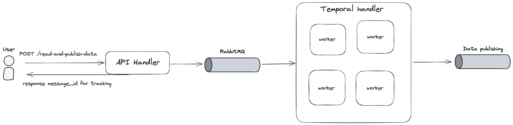

# Running the project 

1. Put the secret (.env files) in the project folder
2. Run `./start.sh`
3. Restart `data-pipeline-app-1` if its fail

# API

1. POST `/read-and-publish-data`
`````````
{ 
  "file_name": "data.csv",
  "file_container": "test"
}
`````````

2. GET `/track?<message_id>` used for tracking

# Design



# Technical decisions

## Throughput

- Asynchronous File Processing: To optimize throughput, file reading is handled asynchronously. Instead of loading the entire file into memory, the data is streamed line-by-line, ensuring minimal memory consumption and faster processing for large files.

- Queue Integration with RabbitMQ: By utilizing RabbitMQ, I decouple the request acceptance from file processing, ensuring the system can handle a higher volume of incoming requests without overwhelming resources. As soon as a file path is received via the API, a message is placed in RabbitMQ to trigger file processing by a worker. This allows for horizontal scalability where more workers can be added to handle multiple files concurrently.

## Scalability

- Batch Processing with Temporal Workers: To handle large files efficiently, the file is read in batches, with the batch size being configurable based on the deployment environment (.env file currently). Temporal workers are utilized to manage file reading, allowing for distributed processing across multiple nodes.

- Resilience via Temporal: The Temporal platform provides native retry mechanisms and fault tolerance, allowing recovery from transient issues such as network glitches or processing bottlenecks, or system failure. This ensures high availability and resilience in case of partial failures.

- Elastic Scaling: Both RabbitMQ and Temporal support elastic scaling, enabling the system to dynamically add more resources based on load, ensuring that performance remains consistent even as file sizes and request volume grow.

## Implementation flaws

- Currently, the feature is still bugging (not working as expected) as I don't having much time implementating this project.
- It lack of tests.
- Config management was not best practice.
- Some professonal industry standards were skipped for simplicity and developer experiences.


